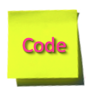

 
  
 
---  

     
    
    

  

    MD: <a href="pages/math.md">Math</a> &bull;
    <a href="pages/pandas.md">Coding</a> &bull;
    <a href="pages/python.md">ML & AI</a> 

-------   

Instructions for how to [set up virtual environments](pages/conda.md) using Conda

--- 

## NLP Stuff  

__Courses__

[NLP Course on YouTube by Stanford](https://www.youtube.com/playlist?list=PL3FW7Lu3i5Jsnh1rnUwq_TcylNr7EkRe6)  

__References__  

[Linguistic glossary](https://www.uni-due.de/ELE/LinguisticGlossary.html)

__Libraries__

[RASP NLP Library](http://users.sussex.ac.uk/~johnca/rasp/)

---  

## Coding Study  

__Complete__

[Matlab Course on Coursera by Vanderbilt University](https://www.coursera.org/learn/matlab/home/welcome) 

__In Progress__  

[Intermediate Python - Django - Flask Projects](https://www.udemy.com/projects-in-python-for-intermediate-build-python-projects/learn/v4/overview)

__In Queue__  
 
[R for Data Science - Online HTML Version](http://r4ds.had.co.nz/)

---
## Cool Sites & Resources

[JSON Viewer](http://jsonviewer.stack.hu/)  
[Math is fun](https://www.mathsisfun.com)   
[Deep Learning Cheat Sheet](https://hackernoon.com/deep-learning-cheat-sheet-25421411e460)   
[Excellent explanation of Precision & Recall](https://www.youtube.com/watch?v=o9A4e7zopu8)  
[Learn XYZ fast](https://learnxinyminutes.com/docs/python3/)

---
## Books

[Free O'Reilly ebooks](https://www.oreilly.com/data/free/)  
[Free SyncFusion ebooks](https://www.syncfusion.com/ebooks/)  

---

## Other Notes

[Google Colab - Free GPU instances](https://colab.research.google.com/)  
[Arxiv - Academic Papers](https://arxiv.org/list/cs.AI/recent)    
[Append item to tuple](https://stackoverflow.com/questions/16730339/python-add-item-to-the-tuple)  

[GitHub Markdown Guide](https://guides.github.com/features/mastering-markdown/)  

---

